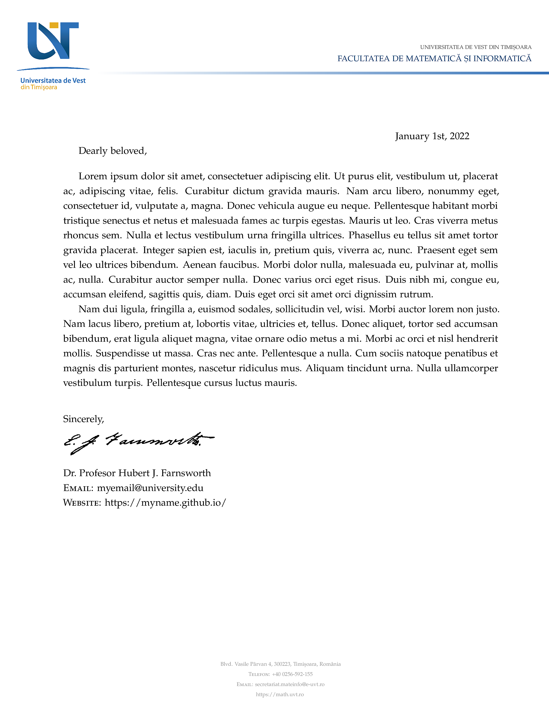

# UVT Letterhead in LaTeX

This is a reproduction of the UVT (West University of Timișoara) letterhead in
Latex. It uses the UVT [branding](https://www.uvt.ro/en/dcimi/identitate-vizuala/)
and [replicates this document](https://docs.google.com/document/d/1qyRK3fjVANnRFPRCYI8VLL42Ay-z07ZM/edit).
A full description of the various parts of the branding can be found in the
[Official Manual](https://www.uvt.ro/wp-content/uploads/2020/07/MANUAL-IDENTITATE-NEW-WEB-FINAL-2016-.pdf).

This is still a work in progress and the instructions on university branding are
not very thorough, so feature requests or bug reports to improve this template
are **very welcome**!

## How to use

Copy `uvt-letterhead.sty`, `template.tex`, and `assets/` to your working directory.
You will need `sig.png` or some other signature image if you want to use one.
Modify `template.tex` as appropriate and build with `pdflatex` (or `xelatex`
or `lualatex` for the adventurous).

Note that, by default this uses the [Myriad Pro](https://fonts.adobe.com/fonts/myriad)
font. This font is available for personal and commercial use and can be easily
loaded with the `XeLaTeX` or `LuaLaTeX` engines. To get it working on `PDFLaTeX`,
use the [FontPro](https://github.com/sebschub/FontPro) distribution.

The package defines the following options used as `\usepacakge[opts]{uvt-letterhead}`.

| Option                            | Description                           |
| :-                                | :-                                    |
| `doublespacing`                   | Use double spaced paragraphs (default `onehalfspacing`) |
| `myriadpro`                       | Load the *Myriad Pro* fonts           |
| `headerlogo`                      | Place the department logo in header instead of footer |
| `department=<value>`              | Use predefined department info (header and footer) |
| `layoutgrid`                      | Adds a debug grid to check alignment  |

The standard branding colors are given below.

| Color                             | RGB
| :-                                | :-
| `UVTLightBlue`                    |  `(52, 113, 183)` |
| `UVTDarkBlue`                     |  `(3, 75, 119)`   |
| `UVTOrange`                       |  `(228, 172, 36)` |

The following commands are available to define the department, author, etc.

| Command                           | Description                           |
| :-                                | :-                                    |
| `\fromdate{<text>}`               | Date (default `\today`)               |
| `\closing{<text>}`                | Closing text (e.g. `Sincerely`) (optional)|
| `\fromsignature{<filename>}`      | Signature file (closing) (optional)   |
| `\fromname{<text>}`               | Author name (closing)                 |
| `\fromemail{<text>}`              | Author email (closing) (optional)     |
| `\fromweb{<text>}`                | Author website (closing) (optional)   |
| `\fromoffice{<text>}`             | Author office / sub-department (header) (optional)|
| `\fromuniversity{<text>}`         | University name                       |
| `\fromuniversitylogo{<filename>}` | Logo for the university               |
| `\fromdept{<text>}`               | Department name (header)              |
| `\fromdeptlogo{<filename>}`       | Department logo (header)              |
| `\fromdeptaddress{<text>}`        | Department address (footer)           |
| `\fromdeptphone{<text>}`          | Department phone (footer)             |
| `\fromdeptemail{<text>}`          | Department email (footer)             |
| `\fromdeptweb{<text>}`            | Department website (footer)           |

The `\fromdept*` commands can be used to overwrite department information set
using `department=name` or to define custom departments that are not yet included.
The following departments are currently defined (and help is very appreciated
to add more!).

| Keyword               | Department                                         |
| :-                    | :-                                                 |
| arte                  | Faculty of Arts and Design                         |
| cbg                   | Faculty of Chemistry, Biology, Geography           |
| drept                 | Faculty of Law                                     |
| feaa                  | Faculty of Economy and Business Administration     |
| fizica                | Faculty of Physics                                 |
| fmi                   | Faculty of Mathematics and Computer Science        |
| uvt                   | Dean / Main office                                 |

Their logos are all expected to live in `assets/uvt-logo-<dept>.png`, but can be
easily overwritten using
```latex
\fromdeptlogo{figures/my-dept-logo.png}
```

## What it looks like

[Full PDF](template.pdf)


## Acknowledgement

The skeleton of `uvt-letterhead.sty` was copied from
[Luke Olson's reproduction](https://github.com/lukeolson/illinois-letterhead) of
the University of Illinois at Urbana-Champaign letterhead, though little of
the original remains.

## License

MIT
