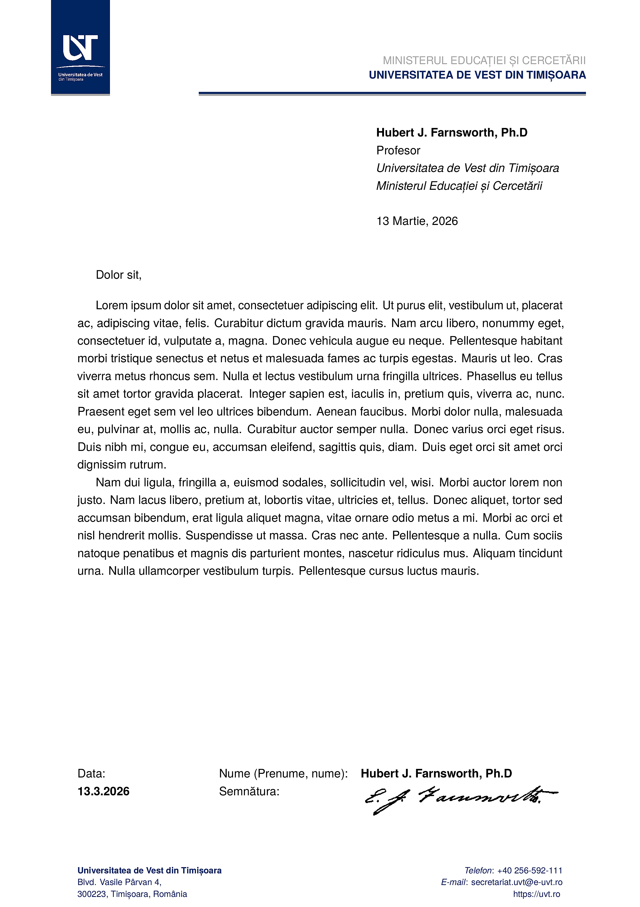

# UVT Letterhead in LaTeX

[](https://github.com/alexfikl/uvt-letterhead/actions/workflows/ci.yml)
[](https://www.overleaf.com/docs?snip_uri=https://github.com/alexfikl/uvt-letterhead/archive/refs/heads/main.zip)

> [!NOTE]
> This template style is fairly complete and working well, but any feature requests
> or bug reports to improve it are **very welcome**! Issues regarding the style
> and differences from the official version are most important.

This is an implementation of the UVT (West University of Timișoara) letterhead in
LaTeX. It uses the [official UVT branding](https://dci.uvt.ro/identitate-vizuala)
and [replicates this document](https://docs.google.com/document/d/1qyRK3fjVANnRFPRCYI8VLL42Ay-z07ZM/edit).
A full description of the various parts of the branding can be found in the
[Official Manual](https://www.dci.uvt.ro/wp-content/uploads/2019/03/MANUAL-IDENTITATE-NEW-WEB-FINAL-2016-.pdf).

Templates in the same series:
* [UVT Letterhead Template](https://github.com/alexfikl/uvt-letterhead)
* [UVT Beamer Presentation Template](https://github.com/alexfikl/uvt-beamer)
* [UVT Conference Poster Template](https://github.com/alexfikl/uvt-poster)

## What it Looks Like

[Full PDF](template.pdf)


## How to Use It

Copy `uvt-letterhead.sty`, `template.tex`, and the relevant logos from `assets/`
to your working directory. Some commands also need a `signature.png` image to
display one (usually at the end). Modify `template.tex` as appropriate and build with
`PDFLaTeX` (or `XeLaTeX` or `LuaLaTeX` for the adventurous).

The package defines the following options used as `\usepacakge[opts]{uvt-letterhead}`.

| Option                            | Description                           |
| :-                                | :-                                    |
| `doublespacing`                   | Use double spaced paragraphs (default `onehalfspacing`) |
| `nomyriadpro`                     | Do not load the *Myriad Pro* fonts (default loads if available) |
| `headerlogo`                      | Place the department logo in header (ignored for `uvt` department) |
| `department=<value>`              | Use predefined department info (header and footer) |
| `showframe`                       | [DEBUG] Shows a frame around page elements (margins, etc.) |
| `layoutgrid`                      | [DEBUG] Adds a debug grid to check alignment  |

The standard branding colors are given below.

| Color                             | RGB
| :-                                | :-
| `UVTLightBlue`                    |  `(52, 113, 183)` |
| `UVTDarkBlue`                     |  `(3, 75, 119)`   |
| `UVTYellow`                       |  `(228, 172, 36)` |

The following helper macros are defined for some standard functionality.

| Macro                             | Description                           |
| :-                                | :-                                    |
| `\uvtdate`                        | Current date formatted in `DD.MM.YYYY`|
| `\uvtopenletter`                  | Adds a standard letter opening on the left   |
| `\uvtcloseletter`                 | Adds a standard letter signature on the left |
| `\uvtcloseform`                   | Adds date on the left and name on the right |

The following commands are available to define the department, author, etc.
The entries marked *letter* refer to the letter opening or closing statement,
the entries marked *header* will appear in the header, and the entries marked
*footer* will appear in the footer.

| Command                           | Description                           |
| :-                                | :-                                    |
| `\fromdate{<text>}`               | Date (default `\today`)               |
| `\closing{<text>}`                | Closing text (e.g. `Sincerely`) (optional)|
| `\fromname{<text>}`               | Author name (letter)                  |
| `\fromsignature{<filename>}`      | Signature file (letter) (optional)    |
| `\fromposition{<text>}`           | Author position (letter) (optional)   |
| `\fromemail{<text>}`              | Author email (letter) (optional)      |
| `\fromweb{<text>}`                | Author website (letter) (optional)    |
| `\fromoffice{<text>}`             | Author office / sub-department (header) (optional)|
| `\fromuniversity{<text>}`         | University name                       |
| `\fromuniversitylogo{<filename>}` | Logo for the university               |
| `\fromdept{<text>}`               | Department name (header)              |
| `\fromdeptlogo{<filename>}`       | Department logo (header or footer)    |
| `\fromdeptaddress{<text>}`        | Department address (footer)           |
| `\fromdeptphone{<text>}`          | Department phone (footer)             |
| `\fromdeptemail{<text>}`          | Department email (footer)             |
| `\fromdeptweb{<text>}`            | Department website (footer)           |

The `\fromdept*` commands can be used to overwrite department information set
using `department=name` or to define custom departments that are not yet included.
The following departments are currently defined. Notably, this does not include
any of the administrative offices that also have logos in the official branding.
Help to add these is very appreciated!

| Keyword               | Department                                         |
| :-                    | :-                                                 |
| arte                  | Faculty of Arts and Design                         |
| cbg                   | Faculty of Chemistry, Biology, Geography           |
| drept                 | Faculty of Law                                     |
| feaa                  | Faculty of Economy and Business Administration     |
| fefs                  | Faculty of Sports                                  |
| ffm                   | Faculty of Physics and Mathematics                 |
| fmt                   | Faculty of Music and Theater                       |
| fpse                  | Faculty of Psychology and Educational Sciences     |
| fsas                  | Faculty of Sociology and Social Work               |
| fsgc                  | Faculty of Political Science and Communication     |
| info                  | Faculty of Computer Science                        |
| lift                  | Faculty of Letters, History, Philosophy and Teology |
| icam                  | ICAM                                               |
| csud                  | University Doctoral Studies Council                |
| uvt                   | Dean / Main office                                 |
| uvt80                 | Dean / Main office (80 year anniversary logo)      |

Their logos are all expected to live in `assets/uvt-logo-<dept>.png`, but can be
easily overwritten using
```latex
\fromdeptlogo{figures/my-dept-logo.png}
```

## Fonts

Note that, by default, this uses the [Myriad Pro](https://fonts.adobe.com/fonts/myriad)
font. This font is generally not available for free, but can be purchased from
Adobe or a [reseller](https://www.fontspring.com/fonts/adobe/myriad-pro). The
OTF fonts can be directly loaded by the `XeLaTeX` or `LuaLaTeX` engines. To
get it working on `PDFLaTeX`, use the [FontPro](https://github.com/sebschub/FontPro)
distribution. If you cannot obtain the font (or the installation does not work
for some reason), it can be disabled with the `nomyriadpro` option. When the font
is not found, the class falls back to using `\usepackage{helvet}`, which loads a
Helvetica look-alike called Nimbus Sans L.

If you are using `XeLaTeX` or `LuaLaTeX`, there are many other nice fonts to
keep in mind that would work well. For example: Carlito (a Calibri clone),
Caladea (a Cambria clone), Montserrat (inspired by Gotham), Adobe Source Sans,
and many others. A nice font will always make your letter look nicer!

## Language

The class provides translations to English and Romanian for all the default
strings (faculty names and such). This can be turned on by using the Babel package
as follows
```latex
\usepackage[romanian]{babel}
\selectlanguage{romanian}
```

Translation fixes and support for additional languages is very welcome!

## Acknowledgement

The skeleton of `uvt-letterhead.sty` was copied from
[Luke Olson's reproduction](https://github.com/lukeolson/illinois-letterhead) of
the University of Illinois at Urbana-Champaign letterhead, though little of
the original remains.

## License

Creative Commons Attribution 4.0 International
